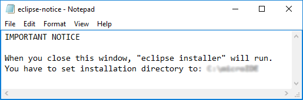
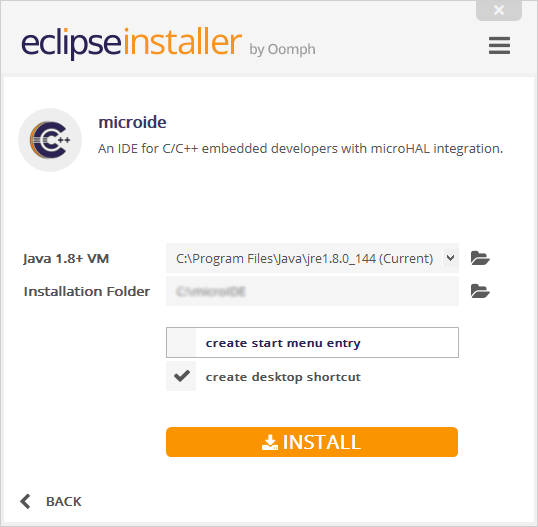
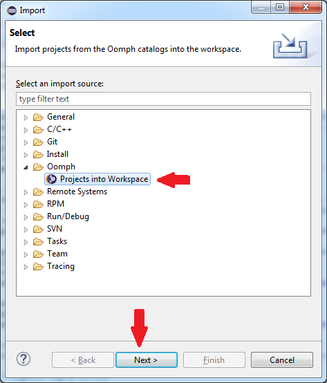
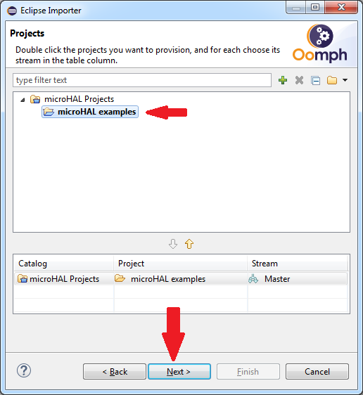
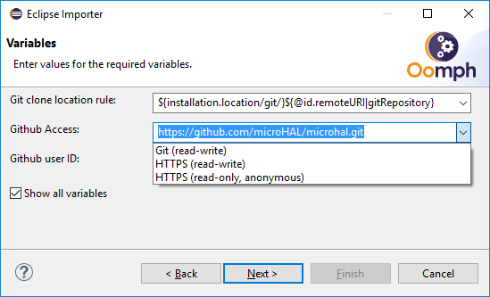
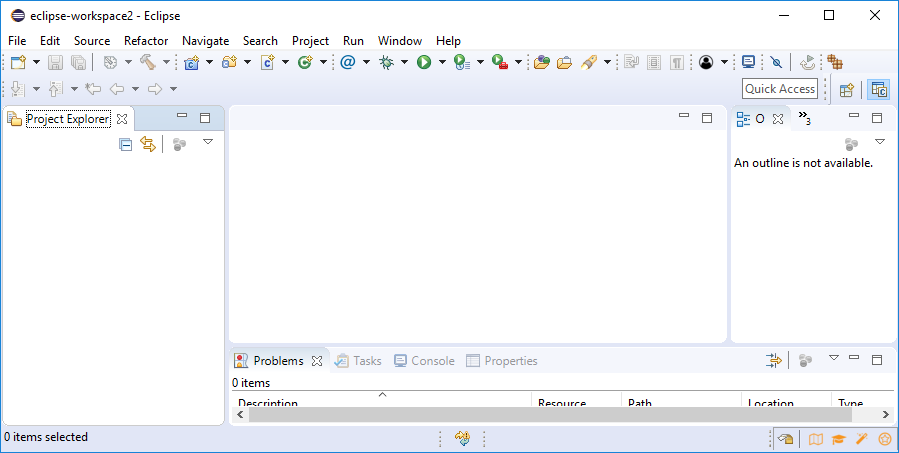
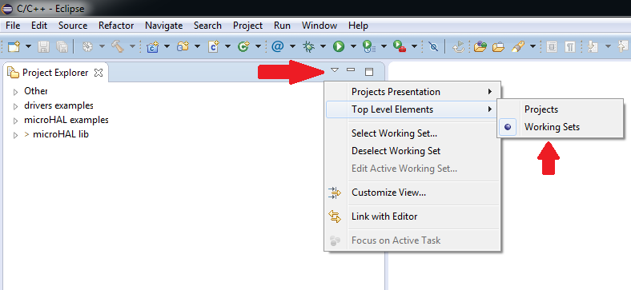

## Microide is eclipse based IDE dedicated for embedded development. 

### Windows installation
To install microide on Windows operating system you should go to our Source Forge project site and download windows binary installer.

Installing microide is simply but have one tricky part. You have put correct path into eclipse installation. Correct path will be shown in IMPORTANT NOTICE text. you should copy this path and pase it into eclipse installer.

 
You should copy this path and pase it into eclipse installer.

### Linux installation
To install microide on Linux operating system download <b>linux/microide_install.sh</b> file from this repository and run it in directory where you want to install microide.

## Importing microhal examples
The best way to start exploring microHAL features is to download all examples and play with them. Examples can be divided into two categorys:
- microHAL examples - these examples were introduced to show you the list of components included in microHAL library. Every component have at least one example to show you its API.
- microHAL drivers - this is set of examples from microHAL subproject that provides drivers for popular and commonly used devices.

To download examples:
- run microIDE,
- open or create new workspace where examples should be stored,
- click <b>File->Import...</b>
- in newly open window please expand <b>Oomph</b> tree and select <b>Projects into Workspace</b> and click <b>next</b> button.

 
 
When new window apear please find and expand <b>microHAL Projects</b> tree. You should see <b>microHAL examples</b> option, please double click on it, the text should change to bold. 
Please keep clicking on <b>Next</b> button until you will see <b>Variables</b> tab. 

 
In Variables tab please sellect <b>Show all variables</b> checkbox and form menu <b>Github Access</b> select <b>HTTPS(read-only, anonymous)</b>.

Afterwards, please keep clicking <b>Next</b> button. Confirm all operations by clicking <b>Finish</b> button. 
When first step of importing examples will finish you will see small icon with exclamation mark in right bottom corner of eclipse. Please click on it and when new window apear click Finish.

 

This will restart eclipse and next step of importing examples will start automatically.

 
It may take a while for all examples to download into your workspace, so please be patient. When all examples will be downloaded project explorer will become messy. To improve readability change display method in project explorer 
to <b>Working Sets</b>.

 

## About microide
Microide is dedicated for embedded development, its integrate tools like:
 - Eclipse CDT for C/C++ development
 - ARM Toolchain
 - Mingw Toolchain
 - Clang Toolchain
 - OpenOCD Debbuger
 - Doxygen for generate documentation from code
 - Graphiz is component required by Doxygen
 - GNU MCU Eclipse plugin that can integrate eclipse with OpenOCD and ARM Toolchain
 
All packages are preconfigured and IDE is redy for use after installing. This installer contain script that will download and install all comptonents.

## Changelog

### 0.3.1
- updated Eclipse to newest version (oxygen)
- updated OpenOCD to 0.10.0 Release 
- replaced GNU ARM Eclipse plugin with GNU MCU Eclipse
- updated MinGW-w64 to 7.1.0
